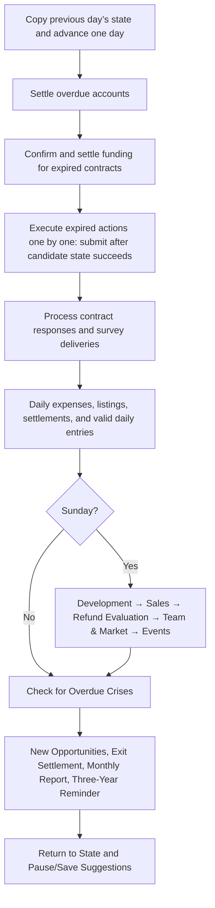

# Simulation Algorithm Description

This document describes the implementation of `playable-1` at the time of export. The symbol `clip(x)` denotes restricting `x` to the interval [0,1];

## 1. State and Time

`GameState` stores the company, developer, project, contract, survey, activity, action, notification, ledger, accounts receivable and payable, daily entries, and order batches. State day 0 corresponds to 2027-01-01, using the UTC calendar function.

The public method `advanceDay` returns the new state and suggestions for `pause` and `autosave`; it does not open pop-up windows, write to files, or wait for real-time elapse.



At the end of the company cycle, a final settlement may be performed for any remaining days. Allocations for contracts expiring on the same day occur before the player’s breach of contract action; therefore, it is not possible to avoid payments that have already become due by exiting on that day.

Weekly development occurs before sales, but sales use the version experience snapshot recorded on that day; the experience from the past few days will not be overwritten by newly generated candidate versions. Demand and competition are updated after weekly sales and affect subsequent settlements.

Translated with DeepL.com (free version)

## 2. Reproducible Randomness

The addressing tuple for `randomAt` is:

```text
[seed, rules, module, entity, time, purpose, record, index]
```

Compute the SHA-256 hash of the JSON string representing the tuple, take the first 64 bits, shift them 11 bits to the right, and divide by 2^53 to obtain a value in the range [0,1). All addressing fields must be in ASCII.

This randomization does not use a global counter that advances with each additional call. Identical addressing will always produce the same sample; modifying the module name, date, purpose, or rules fields will alter the result.

Currently, basic generation still uses the foundation-1 default domain, while commercial use employs the playable-1 domain; industry use employs the industry-v1 module name and the original default rules domain. Do not modify these strings simply for the sake of uniform naming, as doing so will alter the results of existing seeds.

Reproducibility requires that the code, configuration, seed, action sequence, and call order all remain fixed. Floating-point simulation has not yet been proven to be bit-for-bit consistent across all engines and all platforms.

## 3. Industry and Proposals

- 12 fixed, persistent fictional developer profiles.
- Initial number of opportunities: 4 + floor(u × 5), i.e., 4–8.
- On non-initial days: Attempt to generate opportunities when u is no greater than 0.10 + 0.20 × publisher reputation.
- Number of batches: Typically 1; 2 when another sample exceeds 0.86; limited by the number of available developers.
- Do not generate duplicate opportunities if a developer has a collaboration, a settlement in progress, or an active outreach.
- New opportunity window: round(35 + (1 − pressure) × 55 − progress × 22) days.
- A cooling-off period of 14 + floor(u × 40) days is required after an old opportunity ends.
- Response time: 3 + floor(u × 5) days; add 2 days for teams larger than 15 people.
- Validity period after acceptance or counteroffer: 6 + floor(u × 13) days.

“pressure” represents a deterministic sampling scenario for this proposal and does not reflect a complete developer balance sheet model. The “source” tag and fictional regions do not generate independent regional market simulations.

Translated with DeepL.com (free version)

## 4. Negotiation Scores and Probabilities

Let F be the quoted funds/requested funds, A be the advance/requested advance, R be the developer’s revenue share, L be the relationship, and P be the issuer’s reputation.

```text
center = preferenceBonus
       + 0.25 × min(1,F)
       + 0.10 × min(1,A)
       + 0.25 × min(1, R / 0.6)
       + 0.15 × IPFactor
       + 0.10 × ControlFactor
       + 0.05 × RecoupFactor
       + 0.10 × 0.7
       + 0.10 × (L − 0.5)
       + 0.10 × (P − 0.5)
score = center + (2u − 1) × 0.05
```

IPFactor: 1 if the developer retains IP, otherwise 0.2. ControlFactor: 1 for limited advice, 0.7 for joint decision-making, 0.3 for publisher-led. RecoupFactor: 0.55 for priority recoupment, otherwise 1.

Preference Bonus: For autonomy-based models, +0.035 if IP is retained, otherwise −0.04; for revenue-sharing models, (R−0.6)×0.15; for funding-based models, (F−1)×0.05; for cash-flow-based models, (A−1)×0.04.

Score ≥ 0.65: Accepted; Score < 0.45: Rejected; all others: renegotiate. In renegotiation, the requested funding is restored, IP remains with the developer, the publisher’s revenue share does not exceed 40%, and all other terms remain unchanged.

```text
Acceptance Percentage = round(100 × clip((center + 0.05 − 0.65) / 0.10))
Rejection Percentage = round(100 × clip((0.45 − center + 0.05) / 0.10))
Counteroffer Percentage = 100 − Acceptance Percentage − Rejection Percentage
```

This is an estimate of the existing noise range, rounded to whole percentages; it is not a win rate derived from repeatedly simulating future outcomes. `estimateAcceptance` itself does not verify the validity of the quote; a `quoteAction` is required before submission. Funds must be between 50% and 200% of the requested amount, and the prepayment must not exceed four times the requested amount.

Translated with DeepL.com (free version)

## 5. Development Capacity and Versions

The “funded” percentage is calculated by paying the required costs daily from the developer’s working capital. The current capacity is approximately:

```text
capacity = (100/7)
 × (0.4 + 0.6 × production)
 × (0.5 + 0.5 × management)
 × (0.5 + 0.5 × morale)
 × (1 − 0.5 × fatigue)
 × funded / number of collaborative projects within the same team
 × risk adjustment
```

The adjustment is 0.7 during risk events and 1 otherwise. When working capital is insufficient, capacity decreases in proportion to the actual payment rate.

Weekly capacity is first allocated to marketing production tasks, followed by special projects, and then content creation, bug fixes, and polishing. A single marketing preparation task may occupy up to 20% of the current remaining capacity; specialized tasks may account for up to 50% of the current remaining capacity. This is not a user-editable task scheduler.

Content production combines the developer’s creative ability, the project’s potential quality, and ±0.04 noise to determine the quality of new content; overall quality is weighted by the amount of completed content. New content may contain unknown defects; QA identifies defects; fixes consume capacity and may introduce regression issues.

```text
experience = clip(
  0.55 × quality
+ 0.25 × min(1, completedWork / totalWork)
+ 0.20 × polish
− 0.35 × clip((unknownBugs + openBugs) / max(1, 0.10 × totalWork))
)
```

Candidate versions are generated when actual weekly production capacity is available. Candidate versions, scheduled release versions, and officially available versions are stored separately. Updating a candidate version does not automatically change the version players are currently purchasing.

`targetDay` is currently used only for development targets and overdue notifications; it does not force development to stop, nor is it a calculated delivery forecast. There is no uniform completion threshold for release; valid contracts, candidate versions, pricing, and launch fees constitute the primary conditions.

## 6. Marketing and Purchasing

Ad intensity is calculated using a budget function with an upper limit: budget/(budget+scale), to prevent linear, infinite growth in spending. Multi-channel reach is aggregated by multiplying 1 by the product of the unreached probabilities for each channel; the strength of creative evidence influences updates to interest and trust.

The following updates are performed daily for valid daily inputs:

```text
awareness = clip(0.997 × awareness + (1 − awareness) × reach)
targetInterest = clip(0.5 × hiddenQuality + 0.3 × marketingExperience
                    + 0.2 × demand/1.5 − 0.35 × competition)
interest = clip(interest + 0.12 × evidence × (targetInterest − interest))
hype = clip(hype + 0.25 × reach × (hiddenQuality − hype) − 0.015 × hype)
trust = clip(trust + 0.2 × evidence × (clip(0.5 + experience − hype) − trust))
```

The wish list experiences a daily attrition rate of 0.001; new additions are correlated with the remaining audience, impressions, interest, and a coefficient of 0.004.

```text
intent = clip(0.35 × interest + 0.30 × experience + 0.20 × trust + 0.15 × demand/1.5)
prob = clip(0.003 × intent × min(1.6, (referencePrice/price)^0.8)
          × (1−0.45×competition) × (1+0.8×mouth) × (1±0.15))
wishlistSales = floor(wishlist × clip(3 × prob))
generalSales = floor((remainingAudience − wishlist) × awareness × prob)
```

Sales are constrained by a limited audience. Refunds reduce inventory but do not restore the audience that has already made a purchase; therefore, repeat purchases by the same buyer are not currently simulated. Long-term sales cannot expand indefinitely.

## 7. Revenue Sharing, Payment Terms, and Refunds

Each batch of orders is based on the prices and user experience in effect at the time of purchase; prices or version updates that occur later will not be applied retroactively to recalculate these orders.

```text
gross = units × price
net = gross − roundHalfUp(gross × 30%)
recouped = priorityRecoup ? min(net, unrecouped) : 0
publisher = recouped + roundHalfUp((net − recouped) × publisherRate)
developer = net − publisher
```

Sales proceeds are recognized as accounts receivable during weekly settlement, with a due date of the settlement date plus 28 days. This is not simply the purchase date plus 28 days.

Penalties are applied based on overall satisfaction, discrepancies between advertising claims and actual performance, and prices exceeding the reference price. Weekly settlements occurring 7 days after an order is placed generate reviews and refunds: the number of reviewers is approximately floor(units × 0.08), and the number of refunds is approximately floor(units × clip(0.02 + 0.12 × (1 − satisfaction))).

Refunds are offset against the original publisher’s revenue for that batch and restore the corresponding recovered costs. Uncollected receivables are offset first; any shortfall results in future refund payables. A “reviewed/refunded” flag for each batch prevents duplicate processing.

## 8. Finance and Exit

Cash Conservation: cash = initialCash + receipts − payments. The ledger identifies transactions using a unique business key and distinguishes between expense, income, payment, receipt, and income-reversal.

Upon signing the contract, an advance payment and the first 25% of the development funds are paid; the remaining installments are due 28, 56, and 84 days after signing. Unmatured commitments do not equal incurred expenses.

Unilateral Exit: A fixed liquidated damages amount of 8% of the agreed-upon development funds, plus 20% of any unfulfilled disbursements; negotiated compensation is 70% of the unilateral outcome, rounded down to the nearest cent. Specific rounding rules are defined in finance.ts. Negotiations may be rejected.

Exit halts new sales, work, and activities but does not clear historical accounts receivable, liabilities, refunds, or contract records. The status will be changed to “TERMINATED” only after the handover window has elapsed and all relevant settlement conditions have been met.

Projects that have been released retain a minimum support obligation for the first 180 days; active support fees differ from fees for suspended support. Removing a project from the store does not delete the contract.

Failure to make payments by the due date results in the project entering “DISTRESSED” status and triggering a suspension recommendation; failure to settle debts within the 28-day grace period will result in the termination of operations.

## 9. Market, Team, and Events

Demand converges smoothly toward a random target on a semi-annual scale, subject to small perturbations constrained to the range [0.5, 1.5]; competition is sampled at approximately 56-day intervals. Team fatigue and morale fluctuate based on capacity utilization, recovery, and overdue financial obligations.

Natural exposure is triggered weekly, using a base probability of 0.015 and a cooldown of approximately 84 days; team risk is a weighted sum of fatigue, morale, and management capability, subject to thresholds and cooldowns. These mechanisms limit the consecutive stacking of events but do not constitute a complete model of social propagation or competing companies.

## 10. Parameter Changes and Testing

A summary of the configuration JSON is included in the state validation; old archives may be rejected after configuration changes. Although many parameters are stored in the JSON, the current code still contains hard-coded constants, so modifying a specific field in the JSON does not guarantee a corresponding change in behavior.

When adjusting parameters, first identify the actual location where the value is read, then clarify the version and compatibility strategy. Fixed-seed gold testing can detect behavioral changes; after a change occurs, the discrepancy should be explained first—do not directly update the expected summary to mask a regression.
